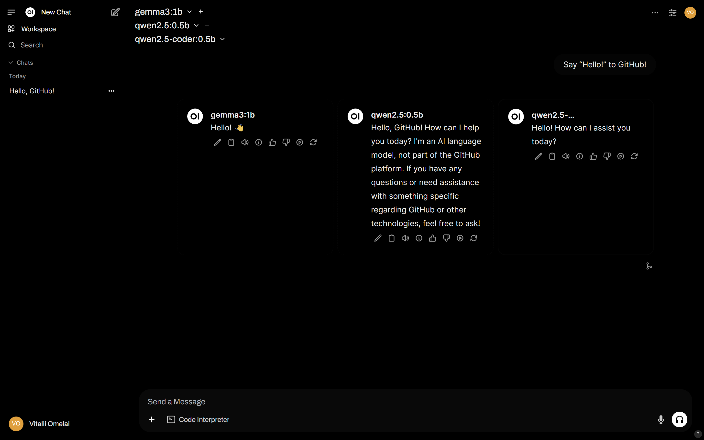

## Overview

This project is designed to deploy and run **large language models (LLMs)** on a **Raspberry Pi**.

## Commands

### Choco

- `choco install terraform`

### Terraform

> [!NOTE]  
> The `local-exec` provisioner commands are intended to run on Windows.

- `terraform fmt -recursive`
- `terraform -chdir=terraform init`
- `terraform -chdir=terraform plan`
- `terraform -chdir=terraform apply`
- `terraform -chdir=terraform destroy`

### SSH

- `ssh-keygen -t rsa -f .ssh/raspberry`
- `ssh -i .ssh/raspberry raspberry@raspberry`

### Open WebUI

- `powershell -ExecutionPolicy Bypass -File .\open-webui.ps1`
